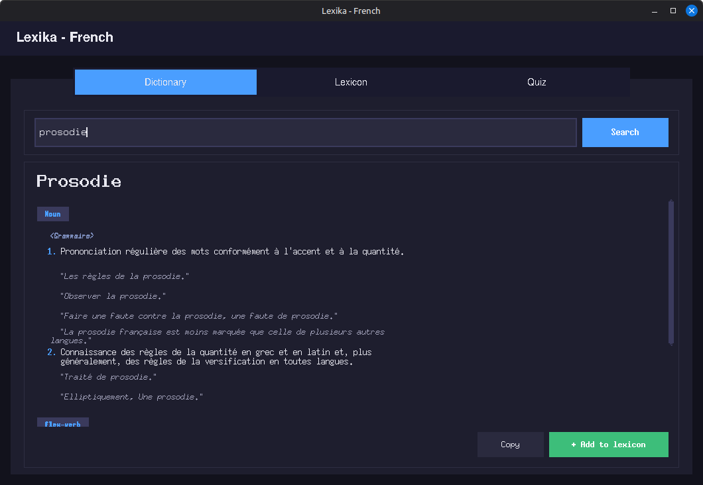
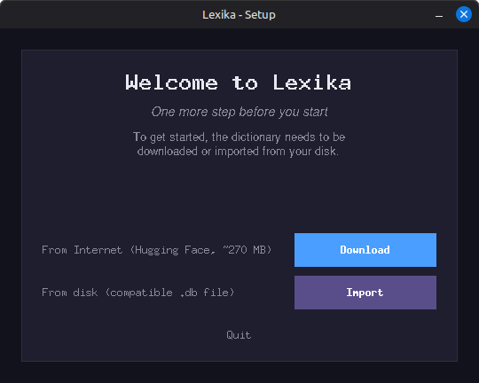
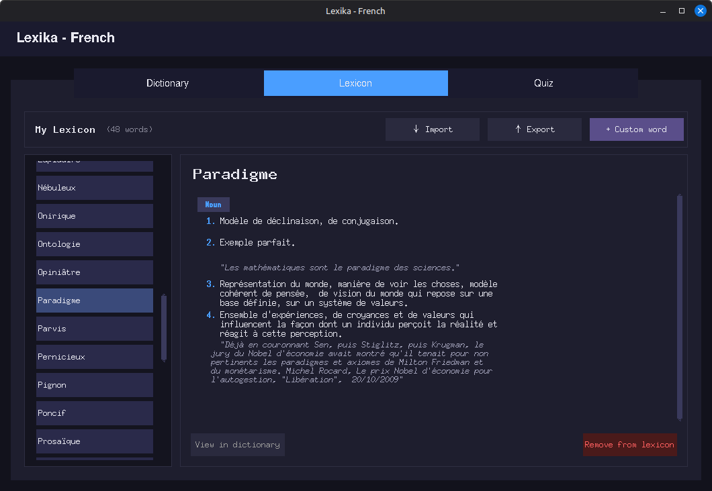
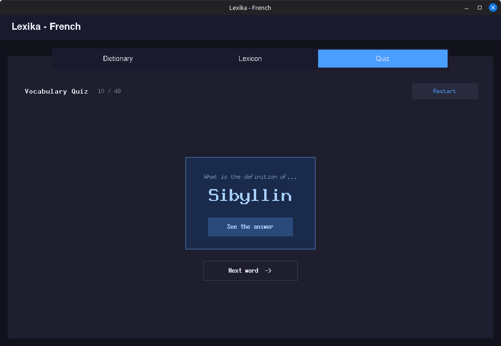

# Lexika - Offline French Dictionary

Lexika is a Python desktop application for browsing a complete French dictionary locally, building a personal vocabulary lexicon, and reviewing it through an interactive quiz.

---

## Overview


---

## Key Features

- **Offline dictionary** with over 800,000 French entries, including conjugated verb forms
- **Structured definitions**: sub-definitions, usage examples, registers (familiar, literary, archaic...) and domains (music, computing...)
- **Smart suggestions** when a word is not found, with support for missing accents (`element` → `élément`)
- **Personal lexicon** to save words you want to remember
- **Custom words**: add your own definitions for terms not found in the dictionary
- **Vocabulary quiz** to review the words in your lexicon
- **Import / Export** the lexicon as a JSON file
- **Modern dark interface** built with CustomTkinter
- **Resizable window** with adaptive layout

---

## Requirements

- Python 3.10 or higher
- Dependencies listed in `requirements.txt`

```bash
pip install -r requirements.txt
```

`requirements.txt`:
```
customtkinter
pillow
```

---

## Installation and First Launch

### 1. Clone the repository

```bash
git clone https://github.com/Kartmaan/lexika-fr.git
cd lexika-fr
```

### 2. Install dependencies

```bash
pip install -r requirements.txt
```

### 3. Run the application

```bash
python main.py
```

On first launch, if `data/french_dict.db` is missing, a setup window appears automatically and offers two options:

- **Download** the dictionary from Hugging Face (~270 MB)
- **Import** a compatible `.db` file already on your disk

The file is automatically validated before use (extension, SQLite structure, data presence).



---

## Project Structure

```
lexika-fr/
├── main.py                  # Entry point
├── requirements.txt
├── assets/
│   ├── icon.png             # Linux icon
│   ├── icon.ico             # Windows icon
│   └── icon.icns            # macOS icon
├── core/
│   ├── dictionnaire.py      # SQLite queries + suggestions
│   └── lexique.py           # Lexicon JSON management
├── ui/
│   ├── app.py               # Main window and tabs
│   ├── setup_window.py      # First-launch setup window
│   ├── tab_dictionnaire.py  # Dictionary tab
│   ├── tab_lexique.py       # Lexicon tab
│   └── tab_quiz.py          # Quiz tab
└── data/
    ├── french_dict.db       # SQLite database (generated at setup)
    └── lexique.json         # Personal lexicon (auto-created)
```

---

## Dictionary Tab

The main tab of the application.

**Search**
- Type a word in the search field and confirm with the button or the `Enter` key
- Search is case-insensitive

**Results display**
- Definitions are grouped by part of speech (Noun, Verb, Adjective...) with a color badge
- Each definition is numbered and may include:
  - Hierarchical sub-definitions
  - Usage examples in italics
  - Register tags *(familiar)*, semantic tags *[figurative]* or domain tags *‹music›*

**Word not found**
- If the word does not exist in the dictionary, Lexika automatically suggests similar words
- The fuzzy search handles **missing accents**: typing `element` suggests `élément`, typing `enchevetre` suggests `enchevêtré`
- Clicking a suggestion directly loads its definition

**Copy to clipboard**
- Copies the selected word and its definitions to the clipboard.

**Add to lexicon**
- An **Add to lexicon** button is available below each result
- If the word is already in the lexicon, a message notifies you

---

## Lexicon Tab

The personal lexicon, laid out in two columns.



**Left column - word list**
- Saved words appear in alphabetical order as clickable tiles
- Words sourced from the dictionary appear in blue
- Custom words appear in purple

**Right column - definitions**
- Clicking a tile immediately displays the full definition in the right column
- A **View in dictionary** button navigates to the Dictionary tab to show the original entry (available only for dictionary-sourced words)

**Lexicon management**
- **Remove** a word from the lexicon using the dedicated button
- **Add a custom word**: opens a form to enter a word and one or more free-form definitions - useful for technical terms, jargon, or neologisms absent from the dictionary
- **Export** the lexicon to a `.json` file of your choice
- **Import** a previously exported lexicon - existing words are preserved and new ones are merged in

---

## Quiz Tab

A tool for reviewing the vocabulary saved in your lexicon.



**How it works**
- The quiz can only start if the lexicon contains at least one word
- Words are drawn in a random order at the start of each session
- Each word appears only once per session

**The flashcard**
- The card first displays the word to define on a blue background
- The **See the answer** button flips the card: it turns green and reveals the definition(s)
- The **See the word** button flips it back to the word side
- The **Next word** button moves to the next word in the session

**End of session**
- When all words have been reviewed, a completion screen shows the number of words covered
- A **Play again** button starts a new session in a different random order

---

## Dictionary Source

The dictionary is derived from **WiktionaryX**, a structured lexical resource parsed from the French Wiktionary, produced by **Franck Sajous**, CNRS research engineer and lecturer in Language Sciences at the University of Toulouse.

Original source: http://redac.univ-tlse2.fr/lexiques/wiktionaryx.html

The `french_dict.db` file is hosted separately on Hugging Face (CC BY-SA 4.0 license):
👉 https://huggingface.co/datasets/Kartmaan/french-dictionary

---

## Licenses

| Component | License |
|---|---|
| Source code (this repository) | MIT |
| `french_dict.db` database | CC BY-SA 4.0 (derived from Wiktionary) |

---