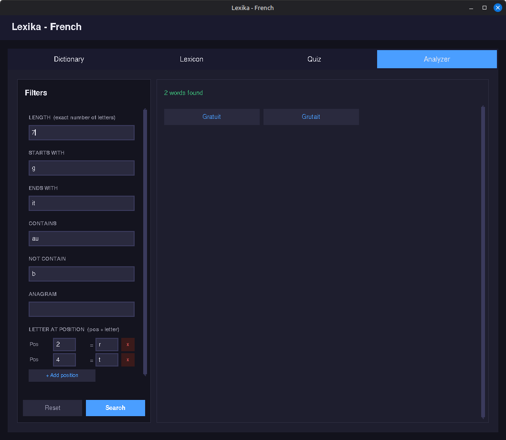
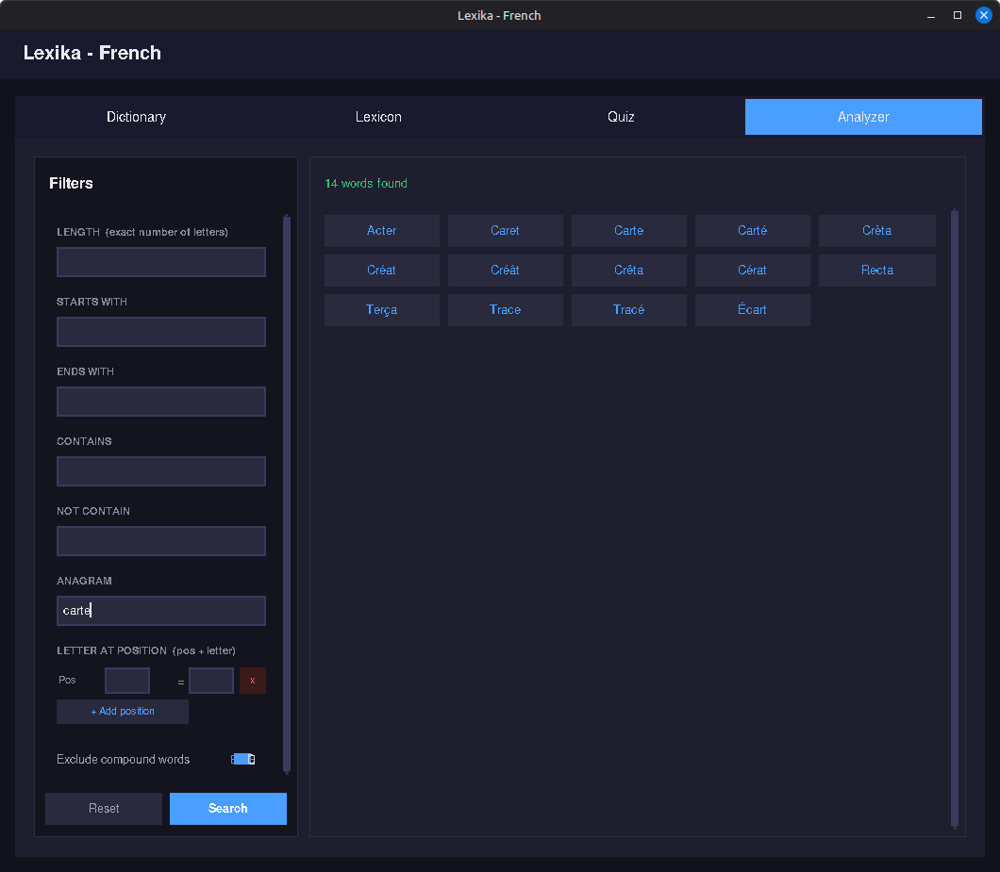

# Lexika - Offline French Dictionary

Lexika is a Python desktop application built around an offline French dictionary of nearly 900,000 entries. It offers four integrated tools: a **dictionary** for looking up words and their structured definitions, a personal **lexicon** for saving and managing vocabulary, a **quiz** for reviewing saved words through interactive flashcards, and an **analyzer** for filtering the entire dictionary using multiple combinable linguistic criteria.

---

## Overview


---

## Key Features

- **Dictionary**: nearly 900,000 French entries, including conjugated verb forms

- **Lexicon**: personal lexicon to save words you want to remember

- **Quiz**: vocabulary quiz to review the words in your lexicon

- **Analyzer**: Word analyzer to filter the dictionary with multiple cumulative criteria

---

## Requirements

- Python 3.10 or higher
- Dependencies listed in `requirements.txt`

```bash
pip install -r requirements.txt
```

`requirements.txt`:
```
customtkinter
pillow
```

---

## Installation and First Launch

### 1. Clone the repository

```bash
git clone https://github.com/Kartmaan/lexika-fr.git
cd lexika-fr
```

### 2. Install dependencies

```bash
pip install -r requirements.txt
```

### 3. Run the application

```bash
python main.py
```

On first launch, if `data/french_dict.db` is missing, a setup window appears automatically and offers two options:

- **Download** the dictionary from Hugging Face (~270 MB)
- **Import** a compatible `.db` file already on your disk

The file is automatically validated before use (extension, SQLite structure, data presence).


---

## Project Structure

```
lexika-fr/
├── main.py                  # Entry point
├── requirements.txt
├── assets/
│   ├── icon.png             # Linux icon
│   ├── icon.ico             # Windows icon
│   └── icon.icns            # macOS icon
├── core/
│   ├── dictionary.py        # SQLite queries, suggestions, analyzer
│   └── lexicon.py           # Lexicon JSON management
├── ui/
│   ├── app.py               # Main window and tabs
│   ├── setup_window.py      # First-launch setup window
│   ├── tab_dictionary.py    # Dictionary tab
│   ├── tab_lexicon.py       # Lexicon tab
│   ├── tab_quiz.py          # Quiz tab
│   └── tab_analyzer.py      # Analyzer tab
└── data/
    ├── french_dict.db       # SQLite database (generated at setup)
    └── lexique.json         # Personal lexicon (auto-created)
```

---

## Dictionary Tab

The main tab of the application.

**Search**
- Type a word in the search field and confirm with the button or the `Enter` key
- Search is case-insensitive

**Results display**
- Definitions are grouped by part of speech (Noun, Verb, Adjective...) with a color badge
- Each definition is numbered and may include:
  - Hierarchical sub-definitions
  - Usage examples in italics
  - Register tags *(familiar)*, semantic tags *[figurative]* or domain tags *‹music›*

**Word not found**
- If the word does not exist in the dictionary, Lexika automatically suggests similar words
- The fuzzy search handles **missing accents**: typing `element` suggests `élément`, typing `enchevetre` suggests `enchevêtré`
- Clicking a suggestion directly loads its definition

**Copy to clipboard**
- Copies the selected word and its definitions to the clipboard.

**Add to lexicon**
- An **Add to lexicon** button is available below each result
- If the word is already in the lexicon, a message notifies you

---

## Lexicon Tab

The personal lexicon, laid out in two columns.


**Left column - word list**
- Saved words appear in alphabetical order as clickable tiles
- Words sourced from the dictionary appear in blue
- Custom words appear in purple

**Right column - definitions**
- Clicking a tile immediately displays the full definition in the right column
- A **View in dictionary** button navigates to the Dictionary tab to show the original entry (available only for dictionary-sourced words)

**Lexicon management**
- **Remove** a word from the lexicon using the dedicated button
- **Add a custom word**: opens a form to enter a word and one or more free-form definitions - useful for technical terms, jargon, or neologisms absent from the dictionary
- **Export** the lexicon to a `.json` file of your choice
- **Import** a previously exported lexicon - existing words are preserved and new ones are merged in

---

## Quiz Tab

A tool for reviewing the vocabulary saved in your lexicon.


**How it works**
- The quiz can only start if the lexicon contains at least one word
- Words are drawn in a random order at the start of each session
- Each word appears only once per session

**The flashcard**
- The card first displays the word to define on a blue background
- The **See the answer** button flips the card: it turns green and reveals the definition(s)
- The **See the word** button flips it back to the word side
- The **Next word** button moves to the next word in the session

**End of session**
- When all words have been reviewed, a completion screen shows the number of words covered
- A **Play again** button starts a new session in a different random order

---

## Analyzer Tab

A word-filtering tool that queries the full dictionary using multiple cumulative criteria.



**Available filters**

All filters are optional and combinable. The more filters are active, the more precise the results.

| Filter | Description | Example input |
|---|---|---|
| **Length** | Exact number of letters | `7` |
| **Starts with** | The word must begin with this prefix | `gr` |
| **Ends with** | The word must end with this suffix | `it` |
| **Contains** | Letters the word must include (continuous or space-separated) | `au` or `a u` |
| **Not contain** | Letters the word must not include | `bx` or `b x` |
| **Anagram** | The word must be an exact anagram of these letters | `carte` or `c a r t e` |
| **Letter at position** | One or more positional constraints (1-indexed) | Pos `2` = `r`, Pos `4` = `t` |
| **Exclude compound words** | Removes hyphenated and multi-word entries (on by default) | toggle |

**Combining filters**

Filters are applied as cascading SQL conditions — each active filter narrows down the previous results. For example:

```
Length = 7, Starts with = g, Ends with = it,
Contains = au, Not contain = b,
Letter at position: Pos 2 = r, Pos 4 = t
→ Gratuit, Grutait
```

**Anagram search**

The anagram filter finds all words in the dictionary that use exactly the same letters as the input, regardless of order. Accented variants are handled automatically — searching `carte` will find `Carte`, `Carté`, `Trace`, `Tracé`, `Acter`, `Caret`, and more.



Anagram can be combined with other filters: for instance, adding **Starts with = t** to `carte` restricts results to anagrams beginning with 't' (`Trace`, `Tracé`).

**Letter at position**

Click **+ Add position** to add a positional constraint row (position + letter). Multiple rows can be stacked for finer control. Each row can be removed independently.

**Results**

- Results are displayed as clickable tiles, sorted alphabetically
- Up to **500 words** are shown per search; a notice appears if results are truncated
- Clicking a tile navigates directly to the **Dictionary tab** to display the word's full definition

---

## Dictionary Source

The dictionary is derived from **WiktionaryX**, a structured lexical resource parsed from the French Wiktionary, produced by **Franck Sajous**, CNRS research engineer and lecturer in Language Sciences at the University of Toulouse.

Original source: http://redac.univ-tlse2.fr/lexiques/wiktionaryx.html

The `french_dict.db` file is hosted separately on Hugging Face (CC BY-SA 4.0 license):
👉 https://huggingface.co/datasets/Kartmaan/french-dictionary

---

## Licenses

| Component | License |
|---|---|
| Source code (this repository) | MIT |
| `french_dict.db` database | CC BY-SA 4.0 (derived from Wiktionary) |

---